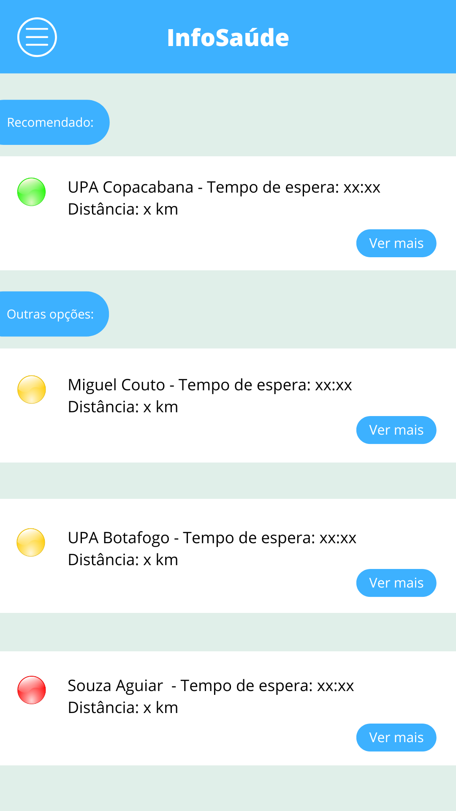
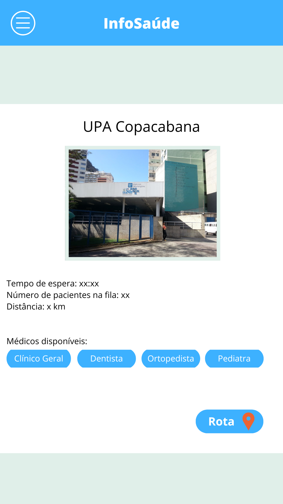

# InfoSaúde

Protótipo de aplicativo desenvolvido como projeto acadêmico com foco em facilitar o acesso a informações de unidades de saúde, como tempo de espera, distância, número de pacientes na fila, especialidades médicas disponíveis e rota até o local.

O projeto foi criado com o objetivo de ajudar usuários a tomar decisões mais rápidas e informadas ao buscar atendimento em UPAs, hospitais ou unidades de pronto atendimento próximas.

---

## Sobre o projeto

O **InfoSaúde** é uma proposta de aplicativo voltado para a área da saúde, pensado para auxiliar pacientes na escolha da unidade de atendimento mais adequada de acordo com critérios como:

* Tempo estimado de espera;
* Distância até a unidade;
* Número de pacientes na fila;
* Especialidades médicas disponíveis;
* Recomendação da melhor opção;
* Acesso à rota até o local.

A ideia principal é reduzir a incerteza do usuário no momento de buscar atendimento, oferecendo uma visão mais clara das opções disponíveis.

---

## Objetivo

O objetivo do projeto foi desenvolver um **Produto Mínimo Viável (MVP)** de uma solução digital para consulta de unidades de saúde, priorizando funcionalidades essenciais para validação conceitual da ideia.

O MVP buscou responder à seguinte necessidade:

> Como ajudar uma pessoa a escolher a melhor unidade de saúde disponível, considerando tempo de espera, distância e tipo de atendimento necessário?

---

## Minha função no projeto

Atuei na **facilitação e organização do escopo do projeto**, liderando uma equipe de **6 pessoas** durante o desenvolvimento da proposta.

Minhas principais responsabilidades foram:

* Organização das ideias principais do projeto;
* Facilitação das discussões em equipe;
* Definição e priorização do escopo;
* Participação ativa na construção do MVP;
* Validação conceitual das funcionalidades;
* Apoio na estruturação da proposta e apresentação;
* Coordenação do time para manter o projeto claro, viável e alinhado ao objetivo.

---

## Funcionalidades propostas

* Listagem de unidades de saúde próximas;
* Indicação de unidade recomendada;
* Exibição do tempo de espera estimado;
* Exibição da distância até a unidade;
* Consulta de especialidades médicas disponíveis;
* Visualização de detalhes da unidade selecionada;
* Botão de rota para direcionamento até o local;
* Classificação visual por prioridade ou condição da unidade.

---

## Telas do protótipo

### Lista de unidades disponíveis

Tela com a recomendação principal e outras opções de atendimento, exibindo tempo de espera, distância e botão para visualizar mais detalhes.



---

### Detalhes da unidade de saúde

Tela com informações detalhadas sobre uma unidade específica, incluindo imagem do local, tempo de espera, número de pacientes na fila, distância, médicos disponíveis e acesso à rota.



---

## Tecnologias e ferramentas utilizadas

* **Canva** — criação das telas e prototipação visual;
* **Design de interface** — organização visual das informações;
* **UX/UI** — definição da experiência do usuário;
* **MVP** — definição das funcionalidades essenciais;
* **GitHub** — documentação e publicação do projeto;
* **Markdown** — estruturação da documentação.

---

## Conceitos trabalhados

* Prototipação de interface;
* Validação conceitual de produto;
* Organização de escopo;
* Priorização de funcionalidades;
* Trabalho em equipe;
* Liderança e facilitação;
* Experiência do usuário;
* Apresentação de solução digital para saúde.

---

## Estrutura sugerida do repositório

```bash
info-saude/
├── assets/
│   ├── tela-listagem-unidades.png
│   └── tela-detalhes-unidade.png
└── README.md
```

---

## Como visualizar o projeto

O projeto pode ser visualizado pelas imagens disponíveis na pasta `assets`.

Caso o protótipo esteja disponível publicamente no Canva, o link pode ser adicionado abaixo:

```text
Link do projeto no Canva: adicionar link público de visualização
```

> Recomenda-se utilizar um link público de visualização, e não um link de edição, para evitar alterações não autorizadas no projeto.

---

## Possíveis melhorias futuras

* Criar uma versão navegável do protótipo;
* Adicionar integração com mapas;
* Simular dados reais de tempo de espera;
* Criar tela de busca por especialidade médica;
* Adicionar filtros por distância, tempo de espera e tipo de atendimento;
* Desenvolver uma versão funcional web ou mobile;
* Criar integração com APIs públicas de saúde, caso disponíveis.

---

## Aprendizados

Durante o desenvolvimento do projeto, foi possível praticar organização de ideias, definição de escopo, criação de MVP, liderança de equipe e validação de funcionalidades.

O projeto também contribuiu para o desenvolvimento de uma visão mais prática sobre como uma solução digital pode ajudar usuários em situações reais, principalmente em contextos onde a informação rápida e clara pode melhorar a tomada de decisão.

---

## Status

Projeto acadêmico finalizado como protótipo conceitual e documentado para fins de portfólio.
